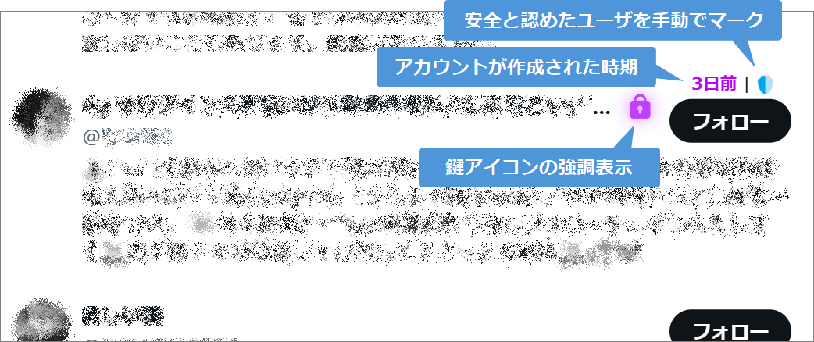

# X Spam Highlighter

PC 版 X のフォロワー覧でスパムの可能性があるアカウントを強調表示する Violentmonkey 用スクリプトです。

フォロワー欄をパァーっとスクロールしながら怪しいアカウントを素早く見つけることを目的としています。

> [!WARNING]
> **強調表示されたアカウントが本当にスパムかどうかはご自身で慎重に判断ください。**
> 事前に定義されたキーワードに基づいて強調表示しているだけですので、正確でないことが多々あります。
> 特に NSFW 系や投資家は誤判定されやすいです。

## インストール方法

1. Chrome または Firefox に [Violentmonkey](https://violentmonkey.github.io/) をインストールします。
2. [こちらのリンク](https://shapoco.github.io/x-spam-highlighter/x-spam-highlighter.user.js) を開き、ユーザースクリプトをインストールします。

## 動かない場合

ページをリロードしてみてください。

フォロワー一覧以外のページから遷移したときに動かないことが多いような気がします。

## 判定基準

- 金配り系
- 投資系
- エロ系
- 出会い系

NG ワードの追加依頼があれば [X でリプライ](https://twitter.com/shapoco/status/1858550973104529823) または [Issue](https://github.com/shapoco/x-spam-highlighter/issues) を起票ください。

## おまけ機能

- 非公開アカウントの鍵マークを強調表示します。
- アカウントの作成日をざっくり推定してフォローボタンの上に表示します。

上記はいずれも「スパムっぽいかどうか」の評価には影響しません。

----
